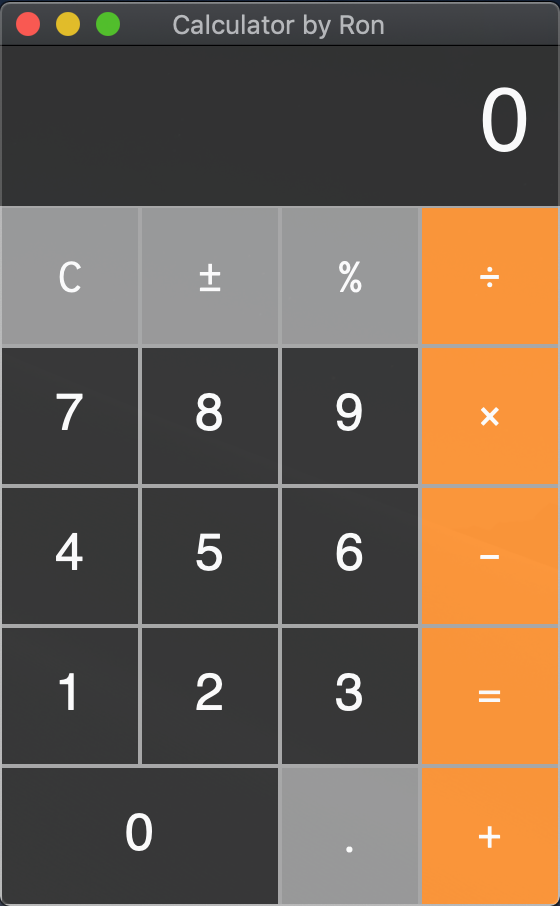

# Calculator building with PyQt5  

### Based on:   
[Qt Calculator GUI Tutorial
](https://www.youtube.com/watch?v=FhV1ZEVNK08&list=PLJ9GeMZoIma5sqa7QAQo5Nm2XDH4JH1uY&index=1) by [Programming Liftoff](https://www.youtube.com/channel/UCALGmYfH2Q9U4Gw4wvZYcww)

### Requirement:  
+ Qt Designer  
+ pyqt5  

### Results  
  
